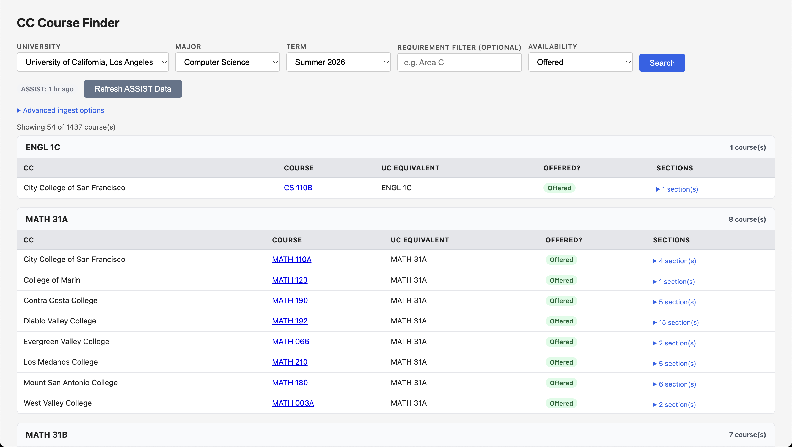

# Community College Course Finder

One query: **which community college courses transfer** (via ASSIST) **and are offered this term** (via live schedule lookups).

## Web UI



**Current status (v0.2):** tuned for UCLA CS; ASSIST ingest fairly complete; schedule coverage about 50 community colleges across Colleague, Banner 9, VSB, WVM, and nine replay-spec colleges.

## Quick start

Prereqs: Python 3.12 + uv

Clone repo, then install deps.

```bash
git clone https://github.com/FYC23/CC-course-finder
cd https://github.com/FYC23/CC-course-finder
```

```bash
uv python install 3.12
uv venv --python 3.12
source .venv/bin/activate
uv sync
```

First-time (required): ingest ASSIST articulation rows into `data/assist.sqlite3`.

```bash
uv run python -m src.assist.cli ingest \
  --target-school "University of California, Los Angeles" \
  --target-major "Computer Science" \
  --max-cc 100
```

Run web UI (joins articulation + schedule availability).

```bash
uv run uvicorn src.web.app:app --reload
```

Open `http://127.0.0.1:8000`.

Optional: run schedule CLI directly (example uses term `"Summer 2026"` and college name substring `"West Valley"`).

```bash
uv run python -m src.schedule.cli query \
  --target-school "University of California, Los Angeles" \
  --target-major "Computer Science" \
  --term "Summer 2026" \
  --cc-name "West Valley" \
  --requirement "MATH 31B"
```

## Problem

Finding community college courses that transfer to a specific university (e.g., UCLA CS) for a given term requires manually cross-referencing two separate systems:

1. **[ASSIST.org](https://assist.org)** — tells you *which* CC courses transfer to your target school/major
2. **Each CC's class schedule** — tells you *whether* that course is actually being offered this term

No existing tool does both in one query. Result: students hand-check school-by-school, term-by-term.

## Plan

### v1 — Baseline (prototype, no AI)

Two components:

**1. ASSIST layer** *(implemented here as a first-pass ingest pipeline)*

- Input: target school + major (e.g., UCLA CS)
- Query ASSIST for agreements across CCs, download the corresponding PDF artifacts, and parse simple direct mappings
- Output: normalized articulation rows in SQLite, queryable by target requirement/equivalent (see CLI examples below)

**2. Schedule layer** *(the novel part)*

- For each CC in the result set, hit their class schedule search
- ~80% of CA CCs run on Banner or PeopleSoft — predictable URL/form patterns
- Parse: is this course offered in the target term? Online or in-person?
- Output: filter ASSIST results to only currently-offered courses

**Stack:** Python; ASSIST ingest via `requests` + `pypdf`; schedule lookups via per-system adapters.

**Final output:** "Here are 12 sections of Calc II transferable to UCLA CS, offered Summer 2026 — 5 are online."

### v2 — Where an LLM might help (optional)

Only pull in an LLM if one of these specific problems comes up:

1. **Messy course name matching** — ASSIST says "Calculus II" but CC lists "Calculus for Life Sciences II." LLM fuzzy-matches better than regex.
2. **Non-standard CC portals** — a handful of CCs don't use Banner/PeopleSoft and have custom HTML. LLM-based extractor can parse arbitrary schedule pages without writing one-off scrapers.
3. **Natural language query interface** — e.g., "find me an online async stats course this summer under 3 units that transfers to UCLA" — that's where an LLM earns its place.

Build the dumb version first. Add LLM only when hitting a wall that can't be rule-based out of.

## Development

### ASSIST layer (current)

This repo now includes a first-pass ASSIST ingestion pipeline under `src/assist`.

- `src/assist/discovery.py` resolves institutions and agreement references.
- `src/assist/fetch.py` downloads and caches agreement artifacts.
- `src/assist/parser.py` runs a minimal deterministic parser for direct mappings.
- `src/assist/store.py` persists normalized articulation rows in SQLite.
- `src/assist/cli.py` provides ingest/query commands.

Artifacts are cached under `data/assist_artifacts/`, and the local SQLite database lives at `data/assist.sqlite3`.

### Local environment

This project uses `uv` with a repo-local `.venv`. Install steps in [Quick start](#quick-start).

### Run tests

```bash
uv run pytest
```

### Run the web UI (prototype)

This repo includes a small FastAPI-backed web UI under `src/web` that joins ASSIST articulation rows with schedule availability for a given term.

```bash
uv run uvicorn src.web.app:app --reload
```

Open `http://127.0.0.1:8000` and search by university, major, term, and optional requirement filter.

Results UX notes:

- Results stream in college by college, with a progress bar ("12 of 41 colleges done"). Colleges are checked in parallel, so a full search takes under a minute rather than tens of minutes. A college whose server refuses the connection is skipped for the rest of that search.
- Grouped by UC requirement.
- Sorted within each group by availability: Offered → Not offered → Couldn't check → Articulation only.
- Availability filter lets you show only one status.
  - "Couldn't check" means the college's schedule site could not be read this time (server down or erroring, or the term isn't listed there); the row says why. It is not the same as "Not offered".
  - "Articulation only" means the course is articulated in ASSIST, but this term's schedule availability wasn't found for that CC/course.
- Sections show meeting days, campus-local times, seats used/total, and a Fit badge computed for the timezone you pick (the page preselects your browser's timezone; choose "Don't check hours" to turn fit off). Daylight saving is applied on both the campus side and your side for each term date. Fit is `Fits`, `Conflicts`, `Async` (no set times, online), or `Unknown`.
- Modality and Hours filters keep a course when at least one of its sections matches.

### Ingest and query (single-target v1)

```bash
uv run python -m src.assist.cli ingest \
  --target-school "University of California, Los Angeles" \
  --target-major "Computer Science" \
  --max-cc 100

uv run python -m src.assist.cli query \
  --target-school "University of California, Los Angeles" \
  --target-major "Computer Science" \
  --requirement "MATH 31B"
```

`--max-cc` caps processing by unique community colleges, not raw ASSIST agreement candidate rows.

If ASSIST changes endpoint routing, you can override `--api-prefix`.

### Schedule query (pilot v1)

The schedule layer now includes a pilot query command under `src/schedule`.

```bash
uv run python -m src.schedule.cli query \
  --target-school "University of California, Los Angeles" \
  --target-major "Computer Science" \
  --term "Summer 2026" \
  --cc-id 2 \
  --requirement "MATH 31B"
```

**College selection:** Default `--cc-id` is `0` (omit the flag): query **all** catalog-backed community colleges that appear in the articulation result. Use a nonzero `--cc-id` to pin one college. `--cc-name` accepts a **case-insensitive substring** of a catalog college name and must match **exactly one** entry (otherwise the CLI errors). `--cc-name` cannot be used together with a nonzero `--cc-id`.

```bash
uv run python -m src.schedule.cli query \
  --target-school "University of California, Los Angeles" \
  --target-major "Computer Science" \
  --term "Summer 2026" \
  --cc-name "West Valley" \
  --requirement "MATH 31B"
```

Current v1 scope:

- Canonical term input is a human label like `"Summer 2026"` (strict `Spring|Summer|Fall YYYY`).
- Schedule request failures are fail-soft per course (`offered=false`, error marker in `raw_summary`).

**Supported colleges and adapters (current):**

Pilot set only; expect this list to expand.


| College                       | `cc_id` | Adapter                                                       | Status      |
| ----------------------------- | ------- | ------------------------------------------------------------- | ----------- |
| Evergreen Valley College      | 2       | `colleague_selfservice` — Ellucian Colleague portal           | works       |
| West Valley College           | 80      | `wvm_static` — `schedule.wvm.edu` static JSON                 | works       |
| Diablo Valley College         | 114     | `vsb_4cd` — VSB `api/class-data` XML                          | stale       |
| Los Medanos College           | 61      | `vsb_4cd` — VSB `api/class-data` XML                          | stale       |
| Contra Costa College          | 28      | `vsb_4cd` — VSB `api/class-data` XML                          | stale       |
| Mount San Antonio College     | 62      | `banner9_ssb` — Banner 9 SSB portal                           | works       |
| City College of San Francisco | 33      | `banner9_ssb` — Banner 9 SSB portal (port 8105)               | works       |
| Los Angeles City College      | 3       | `colleague_selfservice` — (LACCD PeopleSoft, unsupported)     | unsupported |
| College of Marin              | 4       | `marin_colleague` — (unsupported)                             | unsupported |
| College of San Mateo          | 5       | `banner9_ssb` — SMCCD shared Banner 9 portal                  | works       |
| Riverside City College        | 78      | `replay` — RCCD Class Finder OData (`data/specs/78.json`)     | works (codes drift; see note) |
| Norco College                 | 148     | `replay` — RCCD Class Finder OData (`data/specs/148.json`)    | works (codes drift; see note) |
| Moreno Valley College         | 149     | `replay` — RCCD Class Finder OData (`data/specs/149.json`)    | works (codes drift; see note) |
| Cypress College               | 71      | `replay` — NOCCCD static JSON (`data/specs/71.json`)          | works       |
| Fullerton College             | 134     | `replay` — NOCCCD static JSON (`data/specs/134.json`)         | works       |
| American River College        | 27      | `replay` — Los Rios class search HTML (`data/specs/27.json`)  | works       |
| Cosumnes River College        | 142     | `replay` — Los Rios class search HTML (`data/specs/142.json`) | works       |
| Folsom Lake College           | 145     | `replay` — Los Rios class search HTML (`data/specs/145.json`) | works       |
| Sacramento City College       | 126     | `replay` — Los Rios class search HTML (`data/specs/126.json`) | works       |

Full catalog with per-district parameters: `src/schedule/data/colleges.json` (about 40 colleges as of Phase 1). Entries carry `status` (`active`, `stale`, `unsupported`) and `params` (`term_format`, `campus_codes`, `location_match`).

`banner9_ssb` resolves term codes dynamically; campus filtering applied where noted in catalog via `params` or `locations`.

`vsb_4cd` uses the Visual Schedule Builder (`vsb.4cd.edu`) shared by Diablo Valley, Los Medanos, and Contra Costa colleges. Term codes are derived deterministically (`YYYY` + `10`/`20`/`30` for Summer/Fall/Spring). Campus filtering is applied per-block using the `locations` field.

`colleague_selfservice` uses Ellucian's Colleague self-service portal with per-district discovery of location and term codes.

`replay` is a data-driven adapter: each college has a JSON spec at `src/schedule/data/specs/<cc_id>.json` describing up to five HTTP steps (with placeholders such as `{term}`, `{subject}`, `{number}`, values captured from earlier responses, optional caching and bounded pagination) and an extraction block that maps JSON paths or CSS selectors to sections and meetings. Specs are validated against `src/schedule/replay/schema.json` at load. Check them with:

```bash
uv run python -m src.schedule.replay.cli validate
```

Run one college's spec live, or probe every spec with its recorded probe course:

```bash
uv run python -m src.schedule.replay.cli run --cc-id 27 --term "Fall 2026" --course "MATH 400"
```

```bash
uv run python -m src.schedule.replay.cli probe
```

Note on the Riverside district: ASSIST still lists pre-common-course-numbering codes (`MAT 1B`) while the live schedule uses `MATH-C2220`; course matching (below) resolves this.

## Renumbered courses (course matching)

California's Common Course Numbering system has renamed and renumbered courses at several CCs — Riverside's `MAT 1B` is now listed as `MATH-C2220`, for example. ASSIST doesn't always catch up, so a search that only looked a course up by its ASSIST code would miss it and wrongly report "Not offered."

`src/matching` closes that gap. Each search looks an ASSIST course up under every code a college might list it under this term — committed seed data (`src/matching/data/course_aliases.csv`, `subject_renames.csv`) plus a SQLite alias table — and the last code tried is always the original ASSIST code, so a wrong alias can never hide a course still listed the old way. When a match comes from an alias, the web UI shows a note: "Matched via alias: listed as MATH-C2220."

New aliases come from an offline discover pass, not from the search path itself:

```bash
uv run python -m src.matching.cli discover --cc-id 78 --term "Fall 2026"
```

`discover` first checks the college catalog's own "(Formerly ...)" notes, which need no model. If a course still isn't matched and `DECISION_PROVIDER` is set (`llm` or `jev`; see `.env.example` for the provider/model env vars), it asks a decision backend whether a candidate course is the same course, renumbered or renamed, and stores the result: a confident match is applied automatically, a plausible one waits in a review queue, and the rest are stored as `rejected` — not discarded, just not used at query time — so a later `discover` run doesn't ask about the same pair again.

```bash
uv run python -m src.matching.cli review                 # aliases waiting for a human
uv run python -m src.matching.cli approve 12              # or: reject 12
uv run python -m src.matching.cli export                  # promote verified DB rows into the committed seed file
```

A human `approve`/`reject` is final — no later automated pass overwrites it. `DECISION_PROVIDER=none` (the default) still runs the "(Formerly ...)" pass, just without model-assisted matching. See `evals/README.md` for how the decision backends are evaluated against hand-labeled cases before they're trusted for `discover`.

A `reject` only blocks that pair at query time; it does not remove anything from the committed seed file. To remove a bad row that was already committed to `src/matching/data/course_aliases.csv` (e.g. a wrong RCCD crosswalk entry), edit that CSV directly and commit the change.